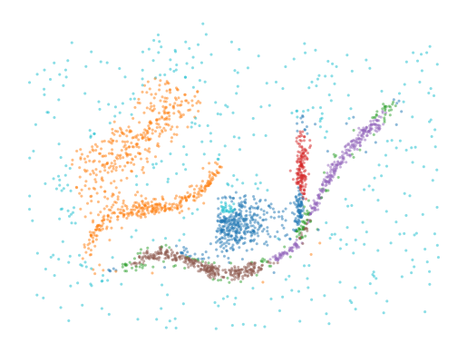

[](https://badge.fury.io/py/biperscan)
[](https://github.com/vda-lab/biperscan/actions/workflows/Wheels.yml)

# Bi-Persistence Clustering of Applications with Noise

`biperscan` adapts HDBSCAN\* to extract clusters from bi-filtrations over a
distance scale and an centrality scale (other lens-dimensions are untested but
might work as well). This type of clustering is particularly useful for
detecting (lower-density) branches in a datasets. Such branches are difficult to
detect with clustering algorithms because they are connected to a central core
with short distances. In other words, there is no gap or low-density region
between branches and the central core, so distance-based clustering algorithms
cannot detect them. The bi-filtration effectively introduces a gap between the
branches by filtering out points with a varying centrality threshold, allowing
the branches to be detected as separate connected components (i.e., clusters).

While `biperscan` is implemented to be fast, it does not scale nicely with data
size. For practical applications, we instead recommend
[pyflasc](https://github.com/vda-lab/pyflasc): our more efficient branch &
cluster detection algorithm. The main difference is that `pyflasc` first
extracts HDBSCAN clusters and then extracts branches within the clusters, rather
than trying to detect both at the same time. This results in two fast
filtrations, instead of one expensive bi-filtration.

## How to use BPSCAN

`biperscan`'s API based on the [`hdbscan`
package](https://github.com/scikit-learn-contrib/hdbscan) and supports a similar API:

```python
import numpy as np
import matplotlib.pyplot as plt

from biperscan import BPSCAN

data = np.load("./notebooks/data/flared/flared_clusterable_data.npy")

clusterer = BPSCAN(
    lens='negative_distance_to_median', # the lens function to use
    metric='euclidean',                 # same as in HDBSCAN
    min_samples=20,                     # same as in HDBSCAN
    min_cluster_size=80,                # same as in HDBSCAN
    distance_fraction=0.05,             # suppress noise at lower values
).fit(data)

plt.figure()
plt.scatter(
    *data.T, c=clusterer.labels_ % 20, s=5, alpha=0.5, 
    edgecolor="none", cmap="tab20", vmin=0, vmax=19
)
plt.axis("off")
plt.show()
```



The labelling can be re-computed with a different depth limit using
`clusterer.labels_at_depth(2)` or accessing the `clusterer.membership_` property
which lists all detected (but overlapping) subgroups. `biperscan` does not (yet)
support weighted cluster membership.


## Example Notebooks

A notebook demonstrating how the algorithm works is available at [How BPSCAN
Works](https://nbviewer.org/github/vda-lab/biperscan/blob/main/notebooks/How_BPSCAN_works.ipynb).
The other notebooks demonstrate the algorithm on several data sets and contain
additional analyses.

## Installing

Binary wheels (for x86_64) are available on PyPI. Presuming you have an up-to-date pip:

```bash
pip install biperscan
```

For a manual install of the latest code directly from GitHub:

```bash
pip install --upgrade git+https://github.com/vda-lab/biperscan.git#egg=biperscan
```
The repository contains C++23 code so a suitable compiler is required to install
from source. The code is tested to compile with MSVC (build tools version 17),
GCC-14 and clang-19.

## Citing

To credit this software please cite the Zenodo DOI: `...` (TODO).

## Licensing

The `biperscan` package has a 3-Clause BSD license.
